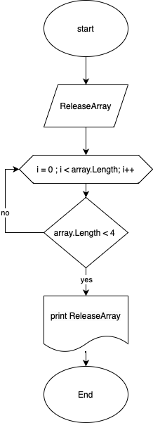

Решение:

1. Очищаем консоль.
2. Просим пользователя ввести колличество символов в массиве.
3. Создаем блок ввода данных и через цикл for со счетчиком i, шаг +1. Вводим элементы массива.
4. Выводим  массив на экран.
5. Создаем блок с новым массивом в который передаем наш исходный массив и через цикл со счетчиком i, шаг +1. Двигаемся до конца массива.
6. Внутри цикла for проверяем  длина каждого элемента старого массива меньше значения "4". Если да, то записываем значение в новый массив.
7. Выводим пустую строку.
8. Выводим конечный массив.

